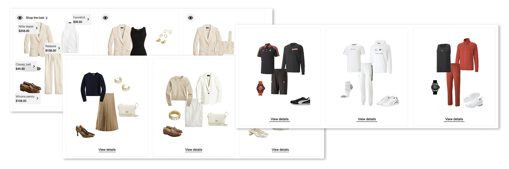
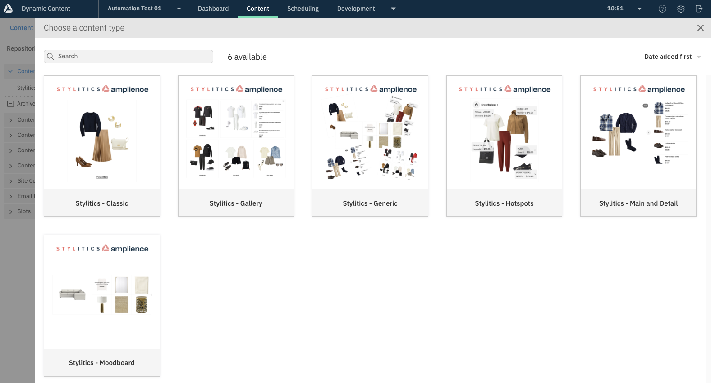
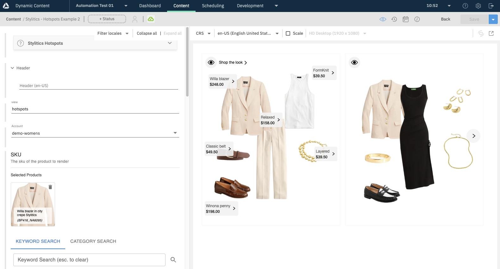
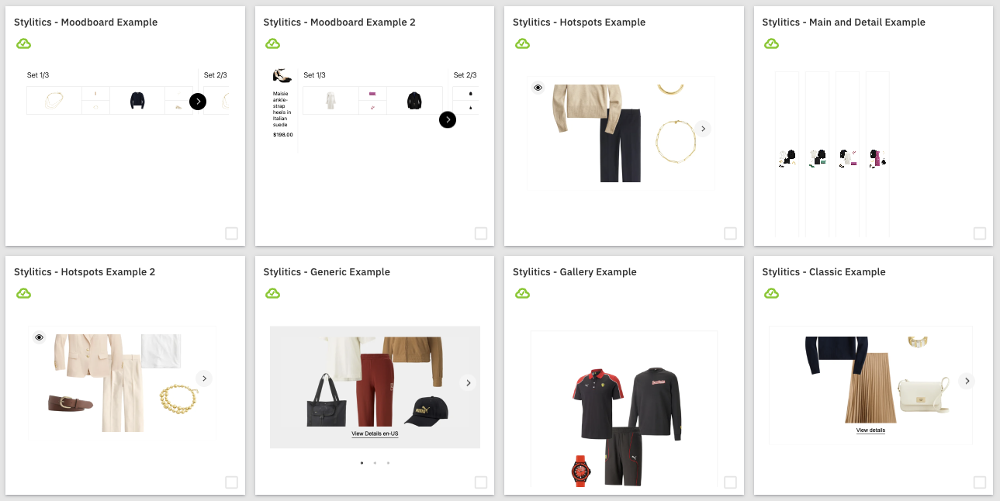
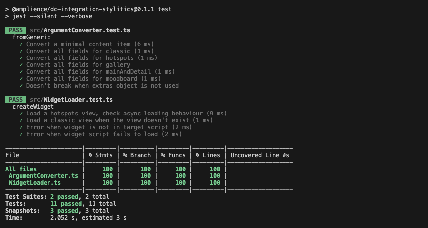

# @amplience/dc-integration-stylitics



A library for managing Stylitics Widgets within modern web frameworks, configuring them with content items from Amplience, as well as a collection of Content Types and Schemas you can install to make integrating Stylitics with Amplience considerably easier.

## ⚙️ Features
- Convert Content Item into Stylitics arguments
- Automatically create Stylitics Widget
- Import Schemas, Content Types, samples Content Items in a Dynamic Content hub
- Use provided Templates for Content Rendering Service visualisation and cards

## Dependency versions

This demo appliction was developed and tested with:

- Node version 18.x
- NPM version 9.x

## 🏁 Quickstart

To use the library, you will just need the two following methods:

- `fromContentItem`: Convert from a content item containing Stylitics widget configuration into arguments you can provide to create the widget.
- `createWidget`: Create a stylitics widget with a given set of arguments, including view type and account. Automatically loads necessary scripts for the view type asynchronously, and keeps them loaded for future requests.

### Usage

Install the package from NPM:

`npm i @amplience/dc-integration-stylitics`

You can use it in your project as follows:

```typescript
import { fromContentItem, createWidget } from '@amplience/dc-integration-stylitics';

// Fetch from DC, in the format found in the automation.
const contentItem = {
    ...
}

const element = document.getElementById('widget');

const args = fromContentItem(contentItem);
const widget = await createWidget(element, args);

widget.start();
```

Similar to using the Stylitics widget manually, you can set overrides before starting the widget, refresh it with new arguments, or `destroy()` it when finished.

### Usage (standalone)
For projects that don't use node, you can import a prepackaged script that places the module in the global scope as `ampStylitics`:

```html
<script src="https://unpkg.com/@amplience/dc-integration-stylitics/dist/ampStylitics.browser.umd.min.js"></script>

<div id="widget"></div>

<script>
    // Fetch from DC, in the format found in the automation.
    const contentItem = {
        ...
    }

    const element = document.getElementById('widget');

    const args = ampStylitics.fromContentItem(contentItem);
    ampStylitics.createWidget(element, args).then(
        widget => widget.start()
    );
</script>
```

## Automation

Included in the automation folder are types and example content you can install in your Amplience Dynamic Content and Content Hub instances to get started with Stylitics.

### Import schemas, types and example content into Dynamic Content



The files in `amplience-automation/automation-files` are content types and content type schemas that allow you to configure a Stylitics widget using Amplience content items. Also included are example content items that demonstrate how they can be used.

The easiest way to import these is through a script included with the project. Use `npm run import` to obtain a list of arguments, and provide them like `npm run import -- --clientId a --clientSecret b --hubId c` to import to a specific hub. One of the options you can provide, `schemaBaseUri`, determines what base URI is used for the schema IDs being imported. If not provided, this will default to `https://demostore.amplience.com/`.

The content types created in this step will rely on assets imported in the next for the cards and visualization to work, though this step should still be performed first.

### Import media and templates into Content Hub



The files in `amplience-automation/media` are images for card icons, and Content Rendering Service (CRS) Templates for visualisation and live card previews in Dynamic Content. They also serve as a good example of how the content item can be used to create a stylitics widget with this library.

The files in `Assets` are all icons used by the content types. They should be imported and published directly in your Content Hub.



The files in `Templates` are CRS Templates that are used for simple visualizations and cards for the Stylitics content types. These should also be imported and published in the Content Hub, though ideally in a different folder to make them easier to manage.

## Development

Node 18.x or later should be used to build the project.

`npm run build`

This builds the project in a variety of configurations:
- `build/main`: es6/commonjs target.
- `build/module`: esnext target.
- `dist`: Webpack distributions meant for loading in the browser. These load the module into the global scope as `ampStylitics`.

## Unit tests

The project includes some simple unit tests to ensure that all possibilies with the argument conversion and widget loader are working as intended.

You can run these with `npm run test`.



## 🌍 Useful Links

- [FAQ](./docs/faq.md)
- [Changelog](./CHANGELOG.md) 
- [Contributing](./CONTRIBUTING.md)
- [Support](./support.md)
- [Licensing](./LICENSE)
