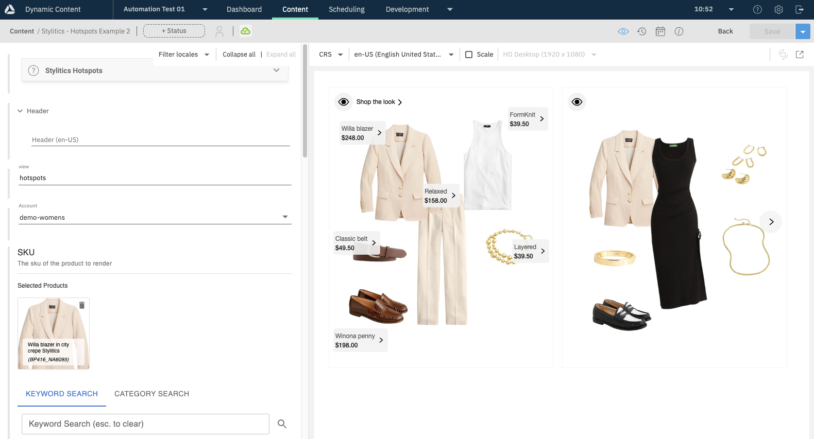

# Automation

Included in the automation folder are types and example content you can install in your Amplience Dynamic Content and Content Hub instances to get started with Stylitics.

Functionality of the automation includes:
 - Content Type Schemas
 - Content Types
 - Extensions (eComm Toolkit, Help)
 - Sample Content for demo accounts and demo SKUs from Stylitics
 - Default Icons
 - Default Cards
 - Default Visualisations

## Prerequisites for automation

Details for what is required to automate into your Amplience account as well as other assumptions and options.

## Mandatory
In order for this automation to work, you must have the following:
- An Amplience Dynamic Content Account.
- A valid API key (`clientId` & `clientSecret`) for this hub with a minimum of a [Developer role](https://amplience.com/developers/docs/concepts/permissions/roles/#developer)
- Your Amplience Dynamic Content `hubId` to import into

## Other assumptions

These are other assumptions for the automation, but can be changes to match your Amplience Dynamic Content account setup.

### Amplience Content Rendering Service

The automation has default visualisations for the Amplience Content Rendering Service (CRS). These may not be applicable to you unless you are using in your implementation and you have this available in your Amplience account.

If you _**do**_ have this feature enabled and you wish to use CRS visualisations, simply
upload the files found in `examples/crs/` folder and publish.

If you _**do not**_ have this feature enabled or simply aren't using it in your implementation, follow [configuring visualisations](#icons-cards--visualisations) to remove the CRS entry.

### Default Repository
The automation assumes that you have a repository in your Dynamic Content hub with a 'name' of `content`. This is default in most account setups.

If you have a different setup, or would like to apply this to multiple repositories simply do the following before running any automation:

1. Browse to `amplience-automation/automation-files/type`
2. Open up all of the `*.hbs` files
3. Find the `repositories` object and amend the name to the repository name (s) in your account
4. Save the files and run the automation

## Running the automation
The files in `amplience-automation/automation-files` are content types and content type schemas that allow you to configure a Stylitics widget using Amplience content items. The folder also includes example content items that demonstrate how they can be used.

The easiest way to import these is through a script included with the project. Use `npm run import` to obtain a list of arguments, and provide them like `npm run import -- --clientId a --clientSecret b --hubId c` to import to a specific hub.

## Automation options

Here is a list of arguments when running `npm run import`:

```
Import Content

Options:
      --help                       Show help                           [boolean]
      --version                    Show version number                 [boolean]
  -a, --automationDir              automation files directory
                   [string] [default: "./amplience-automation/automation-files"]
  -t, --tempDir                    temporary directory for all run files
      --hubId                      amplience hub id          [string] [required]
      --clientId                   amplience client id       [string] [required]
      --clientSecret               amplience client secret   [string] [required]
      --contentRepoId              content repository id     [string] [required]
      --mapFile                    mapFile                [string] [default: ""]
      --schemaBaseUri              mapFile
                           [string] [default: "https://demostore.amplience.com"]
  -o, --omitExtensionEcommToolkit  Use a text field for SKU rather than the
                                   ecomm toolkit extension.            [boolean]
```

These additional options are not mandatory but may be useful:

|Option|Alias|Meaning|
|:----|:----|:----|
|`--schemaBaseUri`| |determines what base URI is used for the schema IDs being imported. If not provided, this will default to `https://demostore.amplience.com`|
|`--omitExtensionEcommToolkit`|`-o`|Will automate your schemas without the eComm Toolkit extension so that you can manually type product references instead of browsing and selecting|

## Automation result
Once you've run the automation, your account will be populated with content schemas, content types, dependant extensions, cards, icons and visualisations all pointing to default Stylitics accounts.

## Customisations & Implementation

### Icons, Cards & Visualisations

The automation comes with default icons, cards and visualisations. These are stand-alone examples to enable you to see get started quickly.

When using for your implementation it is likely that you will want to amend these to point to your application. You can amend directly in each content-type in the Amplience Dynamic Content UI after importing, or amend in the automation before importing.

1. Browse to `amplience-automation/automation-files/type`.
2. Open up all of the `*.hbs` files.
3. Depending on what you would like to change, see the attributes [`icons`](#customising-icons), [`cards`](#customising-cards) or [`visualisations`](#customising-visualisations) object and amend as appropriate.
4. Save the files and run the automation.

#### Customising Icons


The files in `Assets` are all icons used by the content types. You can change to be any https url to an image of your choice. Feel free to use these as a basis.

More information here: [Icons documentation](https://amplience.com/developers/docs/dev-tools/guides-tutorials/content-types/#choosing-an-icon).

#### Customising Cards

These are iframed HTML pages which provide a preview of the content when selecting from the library view.

More information here: [Cards documentation](https://amplience.com/developers/docs/dev-tools/guides-tutorials/content-types/#configuring-a-card).


#### Customising Visualisations

These are iframed HTML pages displayed alongside the Amplience content editor to see the result of your content edits as you make them.

More information here: [Visualisations documentation](https://amplience.com/developers/docs/dev-tools/guides-tutorials/content-types/#setting-up-visualizations).



### Account

This automation comes with a dropdown and selector for some demo accounts from Stylitics for quick prototyping that lets you test a technical implementation and rendering in your application.

If you are a Stylitics customer, will have different account(s) that you are using.

If you have already automated in you can either re-automate with changes, or simply change in the Amplience Dynamic Content UI.

#### Amplience UI
In your account go to content type schemas and edit the 'partial' named `{schemabaseui}/lib/stylitics`.

You will see a JSON object called 'account' which has the following content:

``` json
"account": {
    "title": "Account",
    "type": "string",
    "enum": [
        "demo",
        "demo-home-labels",
        "demo-home",
        "demo-kidboys",
        "demo-kidgirls",
        "demo-labels-classic",
        "demo-mens",
        "demo-womens"
    ],
    "default": "demo"
}
```

Simply replace these with the accounts in use for your Stylitics implementation. You can remove the default value or choose one that applies to you and save.

In order for this to change to take effect, you will have to also sync your Stylitics content-types.

>Note: If you would prefer this as a text field to input rather than a list to select from you can change to the example below. We would recommend a selection list to minimise user error:

```json
"account": {
    "title": "Account",
    "type": "string"
}
```
